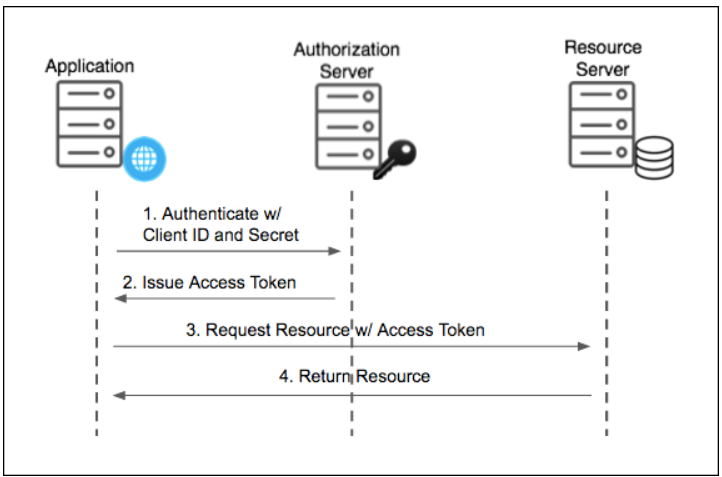

## Oauth2.0 Client credentials/m2m flow with JWT and role claims
- Project demonstrates how to implement the OAuth client credentials grant in spring boot application
  issuing signed JWT tokens with role based claims
- In this flow a machine or service (client) authenticates directly  with the authorization server to obtain an access token, without involving a user.

### Technology used
- Spring Boot + Spring Security
- OAuth2.0 client credentials grant (RFC 6749)
- JWT token and RSA keypair
- AWS ECS/EC2 - Deployment ready taskdefinition.yaml file to AWS ECS

### Architecture of the flow

- Client (e.g. microservice) registers with the Authorization Server and get:
  - client_id
  - client_secret
```
Ways to authenticate for generating a token
1. Post request with clientId and clientSecret in header
2. Post request clientId and clientSecret in body instead of Authorization header
3. JWT signed with client's private key
4. mTLS	Mutual TLS using a client certificate
```
We are using first way to do it as it is more secure compare to second one as
client secret may be logged by proxies in method2.
Third and forth are more complex to implement but can be done.

- Client sends a token request with client id and secret
```
POST /oauth/token
Content-Type: application/x-www-form-urlencoded

grant_type=client_credentials
&client_id=your-client-id
&client_secret=your-client-secret
```
- Authorization Server validates credentials and issues an Access Token
```
{
  "access_token": "eyJhbGciOi...",
  "token_type": "Bearer",
  "expiry": 3600
}
```
- Client uses the access token to call protected resource APIs like "Authorization: Bearer eyJhbGciOi..."
- Token can be validated using public key

## Generate client secrets
In order to support this transaction, for every client secrets are required those need to be generated
locally with any internet tool to keep it secure. One of the easy way to generate client
secrets locally is to use python secrets library.

```
import secrets
# It will generate 32 charecter/16 byte hexadecimal
print(secrets.token_hex(16))
```
Other ways are there if you are using Secret managers of cloud providers like AWS.

## Generate private and public key pair
In order to sign and validate the tokens we need private/public key pairs which can also be generated locally.
We can use openssl already available in git bash to generate private public key pairs.
```
openssl genpkey -algorithm RSA -out private_key.pem -pkeyopt rsa_keygen_bits:2048
openssl rsa -pubout -in private_key.pem -out public_key.pem
```

### Project local setup
1. Generate client1_private.pem & client1_public.pem and place these inside resources/keys folder
2. Generate client secrets and insert in  application.yaml
3. Run the application
